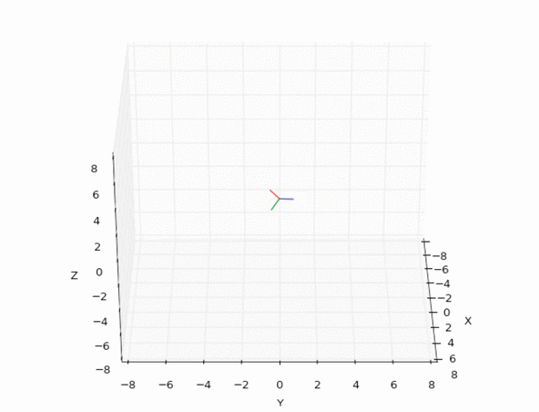

# pyquaternion

[](https://travis-ci.org/KieranWynn/pyquaternion)

A fully featured, pythonic library for quaternion representation, manipulation, 3D animation and geometry.

Please visit the **[pyquaternion homepage](http://kieranwynn.github.io/pyquaternion/)** for full information and the latest documentation.

**Designed for Python 2.7+ and 3.0+**



> Example: Smooth animation with interpolation between random orientations using the pyquaternion module.

## Quickstart

Clone or download, then install via [pip](https://pypi.python.org/pypi/pyquaternion/0.9.0)

```$ pip install <path-to-repo>```

Run the following for a basic overview:

```python
import pyquaternion


# Create a quaternion representing a rotation of +90 degrees about positive y axis.
my_quaternion = pyquaternion.Quaternion(axis=[0, 1, 0], degrees=90)

my_vector = [0, 0, 4]
my_rotated_vector = my_quaternion.rotate(my_vector)

print('\nBasic Rotation')
print('--------------')
print('My Vector: {}'.format(my_vector))
print('Performing rotation of {angle} deg about {axis}'.format(angle=my_quaternion.degrees, axis=my_quaternion.axis))
print('My Rotated Vector: {}'.format(my_rotated_vector))


# Create another quaternion representing no rotation at all
null_quaternion = pyquaternion.Quaternion(axis=[0, 1, 0], angle=0)

print('\nInterpolated Rotation')
print('---------------------')

# The following will interpolate a sequence of 9 intermediate quaternion rotation objects
for q in pyquaternion.Quaternion.intermediates(null_quaternion, my_quaternion, 9, include_endpoints=True):
    my_interpolated_point = q.rotate(my_vector)
    print('My Interpolated Point: {point}\t(after rotation of {angle} deg about {axis})'.format(
        point=my_interpolated_point, angle=round(q.degrees, 4), axis=q.axis
    ))
    
print('Done!')
````

